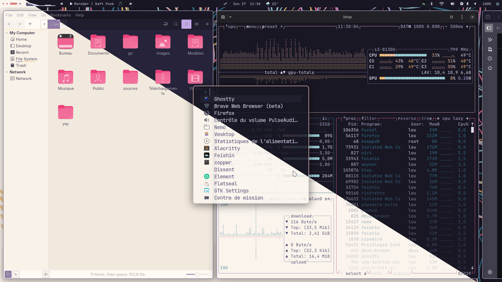

# Lou's rose-pine rice

## Screenshots

# Install
- Copy configs you want from dotconfig to you $HOME/.config/
- Copy the content of xdg-data-dirs to a repertory present in your $XDG_DATA_DIRS envvar, donc forget to replace "<user>" with you user/home folder !

## Prerequisites

Wallpapers are rose-pine official ones

### Mandatory
- niri
- fuzzel
- waybar (compiled with cava support)
- bzmenu
- rose-pine gtk theme
- Suru++ icons
- syshud
- darkman (don't forget to set XDG_DATA_DIRS)
- swaync
- swayidle
- swww

### Optional 
- networkmanager_dmenu
- starship
- pavucontrol (currently use gtk3 pavucontrol as rose pine gtk4 theme seems to be broken)
- hyperlock or swaylock
- ghosty
- \*power-statistics (I use mate-power-statistics)
- wttrbar
- nemo

I hope I didn't forget any

## TODO 

- [] "Qwerty-fy" niri config
- [] "Finish swaync palette
